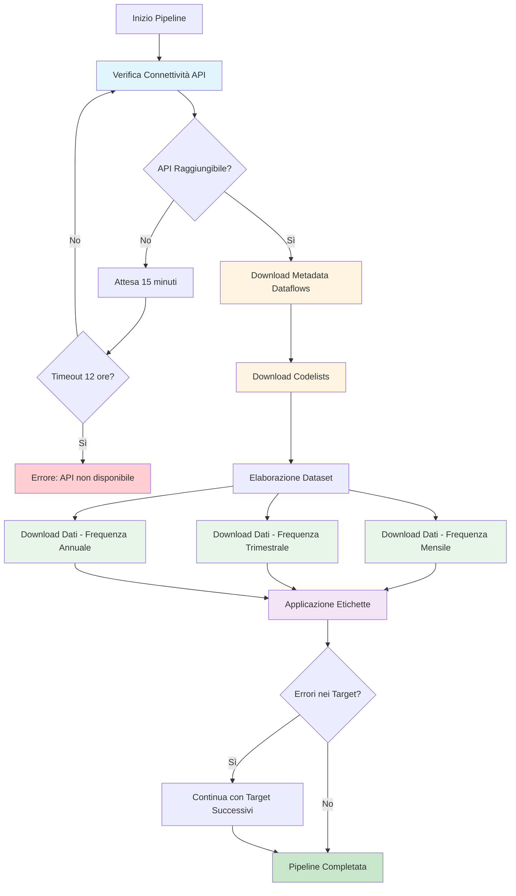

# Workflow Pipeline Targets - istatlab

## Diagramma di Flusso



## Descrizione delle Fasi

### 1. Verifica Connettività API

La pipeline inizia verificando che l'API SDMX di ISTAT sia raggiungibile. Questa fase utilizza la funzione `wait_for_api_connectivity()` che implementa un meccanismo di retry automatico.

**Comportamento:**
- Tenta la connessione all'endpoint ISTAT
- Se non raggiungibile, attende un intervallo configurabile prima di riprovare
- Continua i tentativi fino al timeout massimo configurato
- Se il timeout viene raggiunto, la pipeline termina con errore

### 2. Download Metadata Dataflows

Una volta stabilita la connettività, viene scaricata la lista completa dei dataflow disponibili dall'API ISTAT tramite la funzione `download_metadata()`.

**Caratteristiche:**
- Recupera l'elenco di tutti i dataset disponibili
- Fornisce informazioni strutturali sui dataflow
- Costituisce la base per le operazioni successive

### 3. Download Codelists

Vengono scaricate le codelists necessarie per la traduzione dei codici in etichette leggibili. La funzione `download_codelists()` gestisce questo processo.

**Funzionalità:**
- Scarica le liste di codici per dimensioni e attributi
- Fornisce le traduzioni in italiano dei codici
- Supporta l'applicazione di etichette descrittive ai dati

### 4. Download Dati per Frequenza

I dataset vengono scaricati separatamente per ciascuna frequenza temporale (Mensile, Trimestrale, Annuale) utilizzando la funzione `download_dataset_by_freq_safe()`.

**Strategia di Download:**
- Suddivisione per frequenza per ottimizzare le richieste API
- Gestione separata di dataset multi-frequenza
- Meccanismo di fallback su dati in cache in caso di errore
- Rispetto dei limiti di rate dell'API con delay configurabile

**Gestione Errori:**
- Se il download fallisce, verifica la disponibilità di dati in cache
- Non sovrascrive mai dati validi in cache con valori NULL
- Registra gli errori ma permette alla pipeline di continuare

### 5. Applicazione Etichette

Fase finale in cui vengono applicate le etichette italiane ai dati scaricati tramite la funzione `apply_codelist_labels()`.

**Processo:**
- Sostituisce i codici con le corrispondenti etichette descrittive
- Utilizza le codelists scaricate nella fase 3
- Produce dataset pronti per l'analisi con nomi di variabili leggibili

## Parametri di Configurazione

La pipeline utilizza i seguenti parametri configurabili:

| Parametro | Valore Predefinito | Descrizione |
|-----------|-------------------|-------------|
| `expand_code` | `FALSE` | Espansione codici gerarchici. FALSE limita ai codici root |
| `start_time` | `"2000-01-01"` | Data di inizio per il download dei dati |
| `max_hours` | `12` | Ore massime di attesa per la connettività API |
| `check_interval_minutes` | `15` | Minuti di attesa tra tentativi di connessione |
| `rate_limit_delay` | `12` | Secondi di pausa tra richieste API consecutive |
| `error` | `"continue"` | Comportamento in caso di errore: la pipeline continua |

### Parametri di Connettività

**max_hours**: Tempo massimo di attesa per l'API prima di considerare il tentativo fallito. Un valore di 12 ore consente di gestire manutenzioni programmate notturne.

**check_interval_minutes**: Frequenza dei tentativi di riconnessione. Un intervallo di 15 minuti bilancia la reattività con il carico sul server.

### Parametri di Download

**expand_code**: Quando impostato su FALSE, scarica solo i codici di livello root nelle gerarchie, riducendo il volume di dati e i tempi di download.

**start_time**: Definisce la finestra temporale dei dati. L'impostazione predefinita dal 2000 garantisce serie storiche sufficientemente lunghe per analisi di trend.

**rate_limit_delay**: Pausa tra richieste API per rispettare i limiti del server. Un valore di 12 secondi previene il rate limiting.

### Parametri di Resilienza

**error = "continue"**: Consente alla pipeline di continuare l'esecuzione anche se singoli target falliscono. Questo approccio massimizza il recupero dati anche in presenza di problemi parziali.

## Gestione degli Errori

La pipeline implementa una strategia di gestione errori multi-livello:

### 1. Errori di Connettività API

**Scenario**: L'API ISTAT non è raggiungibile all'inizio della pipeline.

**Gestione**:
- Retry automatico con intervallo configurabile
- Attesa fino al timeout massimo (default 12 ore)
- Messaggio di errore chiaro se il timeout viene superato
- Terminazione controllata della pipeline

### 2. Errori di Download Dataset

**Scenario**: Il download di un dataset specifico fallisce.

**Gestione**:
- Verifica della presenza di dati in cache
- Utilizzo dei dati in cache se disponibili e validi
- Registrazione dell'errore nel log
- Continuazione con i dataset successivi (grazie a `error = "continue"`)
- Preservazione della cache esistente (mai sovrascrivere con NULL)

### 3. Errori di Singoli Target

**Scenario**: Un target specifico nella pipeline fallisce.

**Gestione**:
- Il parametro `error = "continue"` permette l'esecuzione degli altri target
- I target dipendenti da quello fallito vengono saltati
- I target indipendenti vengono eseguiti normalmente
- Report finale indica quali target sono riusciti e quali falliti

### 4. Preservazione della Cache

**Principio fondamentale**: La pipeline non sovrascrive mai dati validi in cache con valori NULL o errori.

**Implementazione**:
- Controllo della validità dei dati scaricati prima del salvataggio
- Mantenimento della versione precedente se il nuovo download fallisce
- Timestamp della cache per tracciare l'età dei dati

## Funzioni Chiave

### wait_for_api_connectivity()

Attende che l'API SDMX di ISTAT diventi raggiungibile.

**Parametri**:
- `max_hours`: Ore massime di attesa
- `check_interval_minutes`: Minuti tra i tentativi

**Comportamento**:
- Ciclo di retry fino al raggiungimento del timeout
- Logging di ogni tentativo
- Errore esplicito se l'API rimane irraggiungibile

### download_metadata()

Scarica l'elenco completo dei dataflow disponibili.

**Funzionalità**:
- Connessione all'endpoint metadata ISTAT
- Parsing della struttura dataflow
- Restituzione di una lista strutturata di dataset disponibili

### download_codelists()

Scarica le codelists per la traduzione dei codici.

**Funzionalità**:
- Download delle liste di codici per tutte le dimensioni
- Gestione delle traduzioni in italiano
- Preparazione per l'applicazione delle etichette

### download_dataset_by_freq_safe()

Scarica un dataset suddiviso per frequenza temporale con meccanismo di fallback.

**Parametri**:
- `dataset_id`: Identificativo del dataset
- `start_time`: Data di inizio
- `expand_code`: Flag per espansione codici gerarchici

**Gestione Errori**:
- Tentativo di download per ogni frequenza (M, Q, A)
- Fallback su cache in caso di errore
- Preservazione dati validi esistenti
- Rate limiting con delay configurabile

### apply_codelist_labels()

Applica le etichette italiane descrittive ai dataset.

**Funzionalità**:
- Sostituzione codici con etichette leggibili
- Utilizzo delle codelists precedentemente scaricate
- Gestione di dimensioni e attributi
- Output di dataset pronti per l'analisi

## Note Operative

### Esecuzione della Pipeline

La pipeline viene eseguita tramite il pacchetto `targets`:

```r
# Esegue l'intera pipeline
targets::tar_make()

# Visualizza lo stato dei target
targets::tar_visnetwork()

# Carica un target specifico
targets::tar_load(nome_target)
```

### Monitoraggio

Durante l'esecuzione, la pipeline fornisce informazioni su:
- Stato corrente del processo
- Target in esecuzione
- Eventuali errori o warning
- Utilizzo della cache

### Manutenzione

**Pulizia della cache**:
```r
# Rimuove tutti i target calcolati
targets::tar_destroy()

# Rimuove target specifici
targets::tar_delete(c(nome_target1, nome_target2))
```

**Invalidazione selettiva**:
```r
# Invalida target specifici per forzare il ricalcolo
targets::tar_invalidate(nome_target)
```

### Best Practices

1. Verificare regolarmente lo stato della pipeline con `tar_visnetwork()`
2. Monitorare i log per identificare pattern di errori
3. Aggiornare periodicamente la cache dei metadata
4. Documentare eventuali modifiche ai parametri di configurazione
5. Testare modifiche alla pipeline su subset di dataset prima dell'esecuzione completa

## Riferimenti

- **targets**: Documentazione del pacchetto targets - https://docs.ropensci.org/targets/
- **istatlab**: Documentazione del pacchetto istatlab
- **API ISTAT**: Documentazione SDMX ISTAT - https://esploradati.istat.it/
